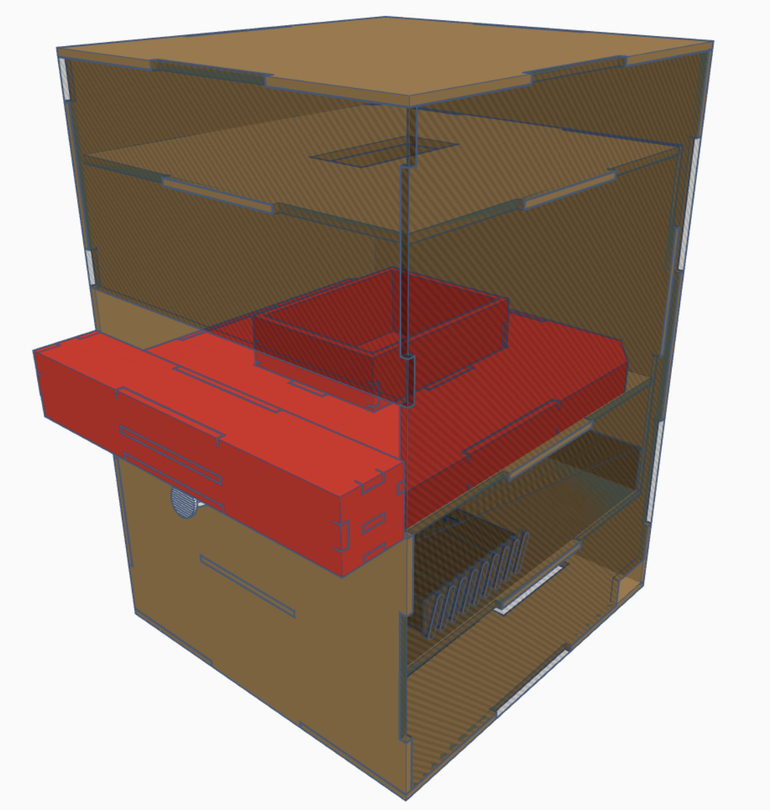

# MedicalTalk - EdgeDevice

This is a medical medication detection project based on edge computing and IoTtalk IoT technology. The project develops a hardware system for assisting identification and deploys it on Nvidia Jetson Nano.

---
## Edge Device Hardware (Ver. 2.0)

> #### Devices:
> * Computer: [NVIDIA Jetson Nano Developer Kit (4GB RAM)](https://developer.nvidia.com/embedded/jetson-nano-developer-kit)
> * Camera: [Logitech C922 PRO HD STREAM WEBCAM](https://www.logitech.com/zh-tw/products/webcams/c922-pro-stream-webcam.960-001091.html)
> * Light controller: [Arduino Nano](https://store-usa.arduino.cc/products/arduino-nano?selectedStore=us)
> * Barcode scanner: [FILUX FS-2800](https://www.filux.com.tw/products/scan-fs-2800)
> * Touch screen: [WAVESHARE 7inch Touch Screen](https://www.waveshare.com/7inch-hdmi-lcd-h-with-case.htm)


> #### Equipment Appearance:
>

---
## Requirements
>  Jetson Nano system Image:
>> Write system image with JetPack 4.6 or later, and set the boot device to the USB flash drive.
>>> *If the Nano is booting up for the first time, please [Write the Image to the microSD Card](https://developer.nvidia.com/embedded/learn/get-started-jetson-nano-devkit#write) and boot once to upgrade the boot loader.*

>  Python environment:
>> Python 3.6.9 or later with all [requirements.txt](../Edge_device/GUI/requirements.txt) dependencies installed. To install run:
>> ```bash
>> pip3 install -r GUI/requirements.txt
>> ```

>  Arduino environment:
>> *Install the Arduino IDE (AARCH64 Ver.1.8.10).*
>> ```shell
>> # Download-> https://downloads.arduino.cc/arduino-1.8.10-linuxaarch64.tar.xz
>> # Move to ~/下載/arduino-1.8.10-linuxaarch64/arduino-1.8.10/
>> $ sudo ./install.sh
>> $ cd ~/Desktop/
>> # Change owner
>> $ chown medical arduino-arduinoide.desktop 
>> # Click the new shortcut on Desktop, and select trust.
>> # This will be reset after reboot -> sudo chmod 777 /dev/ttyUSB*
>> # So, you had to use the next command
>> $ sudo adduser medical dialout
>> ```

---
## A short introduction to the GUI config file
A config file in Vapor ([`config_files/GUI_default.cfg`](../Edge_device/config_files/GUI_default.cfg)) is basically a JSON file with keys and values, like this:
```json
{
    "Device_ID": "Device_Demo",
    "ServerURL": "http://class.iottalk.tw:9999",
    "syringe_scale_img_save_path": "./",
    "arduino_serial_com_port": "/dev/ttyUSB0",
    "arduino_serial_baud_rates": 115200,
    "homography": [[684, 387], [1897, 370], [680, 675], [1902, 695]],
    "template_fig_path": "./GUI/images/match_fig_template",
    "px2unit": {"1 ml": "(abs(round((pixel_y-45)/(681-45)*1, 2)), pixel_y)",
                "3 ml": "(abs(round((pixel_y-61)/(550-61)*3, 1)), pixel_y)",
                "5 ml": "(round((pixel_y-62)/(588-62)*5+0.1, 1) if round(round((pixel_y-62)/(588-62)*5, 1)%0.2, 1) == 0.1 else abs(round((pixel_y-62)/(588-62)*5, 1)), pixel_y)",
                "10 ml": "(round((pixel_y-63)/(768-63)*10+0.1, 1) if round(round((pixel_y-63)/(768-63)*10, 1)%0.2, 1) == 0.1 else abs(round((pixel_y-63)/(768-63)*10, 1)), pixel_y)"}
}

```
---
## File Tree
    .
    ├── Arduino_code/env_light/
    │   └── env_light.ino (The light controller(Arduino nano) code)
    │
    ├── config_files/ (Save all the config files)
    │   ├── .credentials/google-drive-credentials.json
    │   ├── client_secret.json
    │   ├── GUI_default.cfg (config with IoTtalk, ArduinoSerial, SyringeMeasuring)
    │   ├── libdarknet.so
    │   ├── obj.data
    │   ├── obj.name
    │   ├── test.txt
    │   ├── train.txt
    │   ├── yolov7-tiny.cfg
    │   └── yolov7-tiny_final.weights
    │
    ├── GUI/ (Python package)
    │   ├── images/ (All image files)
    │   │   ├── match_fig_template/ (Use for match_template method)
    │   │   │   ├── 1ml.png
    │   │   │   ├── 3ml.png
    │   │   │   └── etc...
    │   │   ├── logo.png
    │   │   ├── barcode_scan.jpg
    │   │   └── etc...
    │   ├── __init__.py
    │   ├── auth.py
    │   ├── check_upgrade.py (unfinished)
    │   ├── csampi.py (IoTtalk lib)
    │   ├── DAN.py (IoTtalk lib)
    │   ├── darknet.py
    │   ├── light_control.py (control light by serial)
    │   ├── main.py (Main Code)
    │   ├── pill_yolo.py
    │   ├── requirements.txt (Pip requirements file)
    │   ├── syringe_scale.py (syringe scale algorithm)
    │   ├── webcam_video_stream.py (webcam streaming)
    │   └── yolo_darknet.py
    │
    ├── README.md
    └── system_start_up.py (Startup Code)
    
    7 directories, 48 files

---


## How to Write/BackUp the system image in windows
*Use "USB Image Tool" BackUp: https://www.alexpage.de/usb-image-tool/download/*
```
Mode: Device Mode
BackUp: clone the system image
```
*Use balenaEtcher write: https://www.balena.io/etcher/*
```
Select image: Choose the system image which you want to use.
Select drive: Choose the SD card or USB device which you want to write.(It will be format) 
```
*If you want to boot from USB device*
```shell
# Use the same mrthod(SD card) to write the USB device.
$ sudo mount /dev/sda1 /mnt
# open /mnt/boot/extlinux/extlinux.conf
# change root=/dev/mmcblk0p1 to root=/dev/sda1 and save it.
# Shutdown and remove the SD card.(Keep the USB device)
# Boot will load from USB device.
```

*Nano cant not Boot (Black screen)*
```shell
# Download NVIDIA SDK Manager (.deb)
# https://developer.nvidia.com/nvidia-sdk-manager
# ref: https://juejin.cn/post/7099653549713260575
$ sudo apt install ./{sdkmanger_file}
$ sdkmanger
```

---
