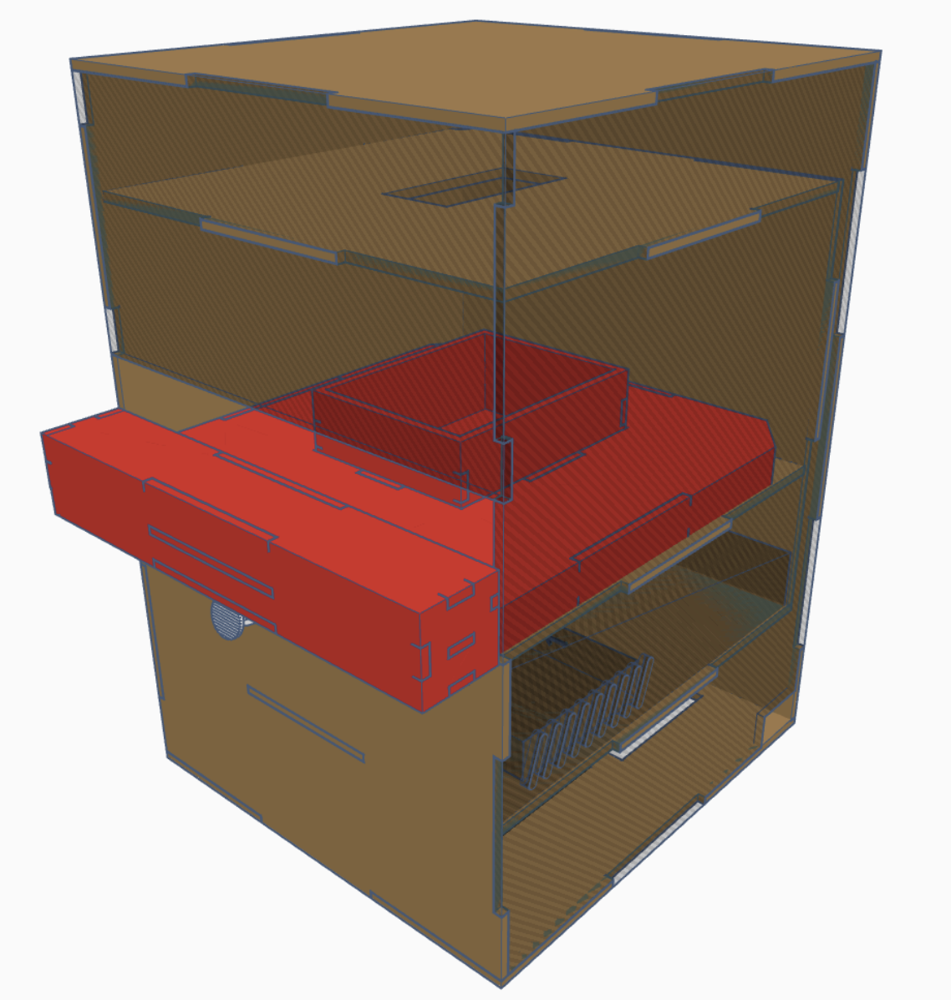

# MedicalTalk - EdgeDevice

This is a medical medication detection project based on edge computing and IoTtalk IoT technology. The project develops a hardware system for assisting identification and deploys it on Nvidia Jetson Nano.

----------------------------------------
## Equipment Appearance


----------------------------------------
## Requirements
Python 3.6.9 or later with all [requirements.txt](../Edge_device/requirements.txt)
dependencies installed. To install run:
```bash
pip3 install -r GUI/requirements.txt
```

----------------------------------------
## A short introduction to the GUI config file
A config file in Vapor (`config_files/GUI_default.cfg`) is basically a JSON file with keys and values, like this:
```json
{
    "Mechine_ID": "01",
    "ServerURL": "http://1.iottalk.tw:9999",
    "Reg_addr": null,
    "d_name": "medical_bottle_nano_ID_01",
    "syringe_scale_img_save_path": "./",
    "arduino_serial_com_port": "/dev/ttyUSB0",
    "arduino_serial_baud_rates": 115200,
    "homography": [[684, 387], [1897, 370], [680, 675], [1902, 695]],
    "template_fig_path": "./GUI/images/match_fig_template",
    "px2unit": {"1 ml": "(abs(round((pixel_y-45)/(681-45)*1, 2)), pixel_y)",
                "3 ml": "(abs(round((pixel_y-61)/(550-61)*3, 1)), pixel_y)",
                "5 ml": "(round((pixel_y-62)/(588-62)*5+0.1, 1) if round(round((pixel_y-62)/(588-62)*5, 1)%0.2, 1) == 0.1 else abs(round((pixel_y-62)/(588-62)*5, 1)), pixel_y)",
                "10 ml": "(round((pixel_y-63)/(768-63)*10+0.1, 1) if round(round((pixel_y-63)/(768-63)*10, 1)%0.2, 1) == 0.1 else abs(round((pixel_y-63)/(768-63)*10, 1)), pixel_y)"}
}
```
----------------------------------------
## File Tree
    .
    ├── config_files/ (Save all the config files)
    │   ├── GUI_default.cfg (GUI config file)
    │   └── others (unfinished)
    ├── GUI/ (Python package)
    │   ├── requirements.txt (Pip requirements file)
    │   ├── images/ (All image files)
    │   │   ├── match_fig_template/ (Use for match_template method)
    │   │   │   ├── 1ml.png
    │   │   │   ├── 3ml.png
    │   │   │   └── etc...
    │   │   ├── logo.png
    │   │   ├── barcode_scan.jpg
    │   │   └── etc...
    │   ├── init.py
    │   ├── check_upgrade.py (unfinished)
    │   ├── csampi.py (IoTtalk lib)
    │   ├── DAN.py (IoTtalk lib)
    │   ├── light_control.py (control light by serial)
    │   ├── main.py (Main Code)
    │   ├── syringe_scale.py (syringe scale algorithm)
    │   └── webcam_video_stream.py (webcam streaming)
    ├── system_start_up.py (Startup Code)
    └── README.md
    
    4 directories, XXX files

----------------------------------------
